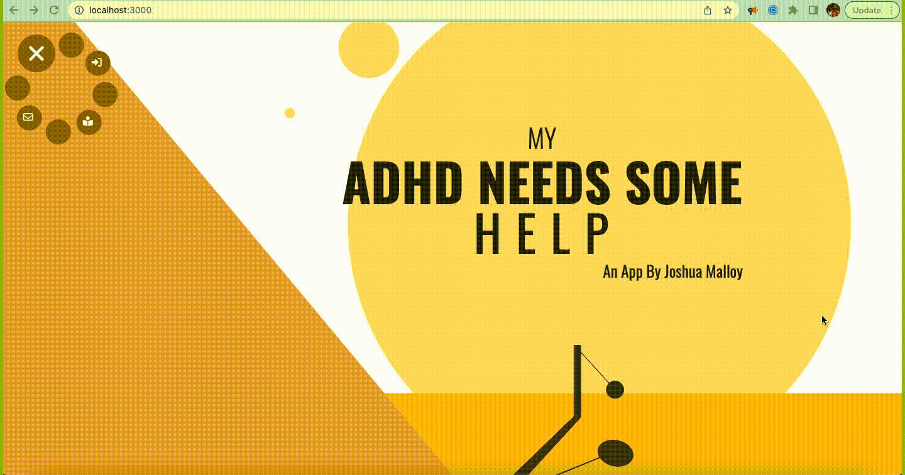

# My ADHD Needs Some Help

## Description
This is an app for those who live with ADHD. At its core, its It's main features are listed below.

## Features
The core features are:
1. 📝 `Task Tracking` -- allowing users to track, delete, and edit their tasks for the week. 
-  ___**A big thing to note here:**___ before tracking any task, the user is prompted to list self-care tasks they've done <ins>___prior___</ins> to wanting to start a task. This is intentional, and primarily because living with ADHD means being frustrated at how much the world is not built for neurodiverse people. And oftentimes, it means blaming yourself for the tasks you can't accomplish. As a user is tracking their tasks, the app is also tracking how much self-care work they put into themselves too -- because even if they didn't accomplish their goal, there's still so much invisible work that should also be recognized as a success. 
2. 🎷 `The Music Stopwatch` -- instead of a traditional alarm (one that's filled with an alarm sound at the end of the timed amount), we're looping music all-throughout the timed amount, and stopping the audio once the time is up.
-  ___**Reasoning:**___ Research indicates that music strengthens areas of the brain that, in people with ADHD, are weaker than neurotypical people. Silence during a timed amount will not help people with ADHD get into a flow state in order to accomplish their tasks. And alarms at the end are honestly just dismissible. 
3. 💡 `Decision-making Support` -- allowing the user to store recipes. When its time to eat, and they're struggling with deciding ___what___ to eat, we are randomly feeding them one of their recipes, depending on the time of day (ex. if it's currently 10am, we'll show them one of a random breakfast recipe from their "recipe book").
-  ___**Reasoning:**___ Those with ADHD are often great at making "hot decisions" at urgent moments, but we are not as good at making "cold decisions," which require us to make up our minds after a lot of thought, like eating. Because people with ADHD are <ins>four times more likely</ins> to experience disordered eating, this tool streamlines a process that gets people stuck ___**and**___ empowers them to create their own well of cooking knowledge. Having users create recipes and instructions themselves will, ideally, leave users thinking ___"hm, maybe I am more capable and more in control of my care than I give myself credit for."___
4. 🎨 `Dynamically-created Artwork` -- creating custom artwork every day and with every refresh. Handled with CSS & Javascript. Customized and located in their dashboard. 
5. 💎 `Dashboard` -- giving summaries of their tracked tasks, self-care history, and abilities to manage tasks.

## Tech Used
- Node.js, Express, Mongodb, Mongoose, Passport.js
- SCSS, CSS animation
- Geolocation Api
- Built out custom RESTful Api

## Lessons Learned
<ins>___A LOT!___</ins>. Reach out via email and lets talk about it! 📩